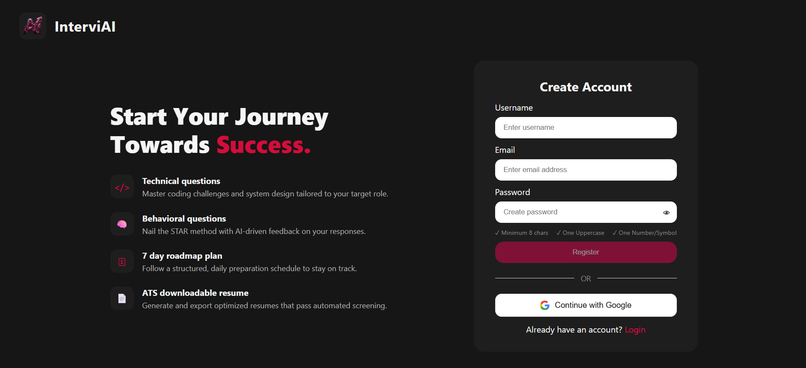
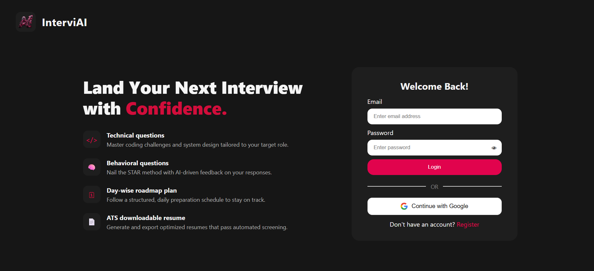
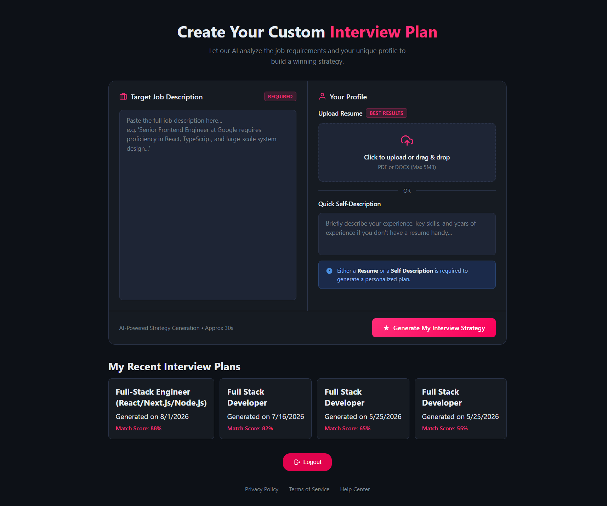
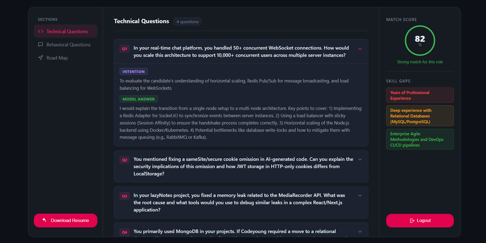
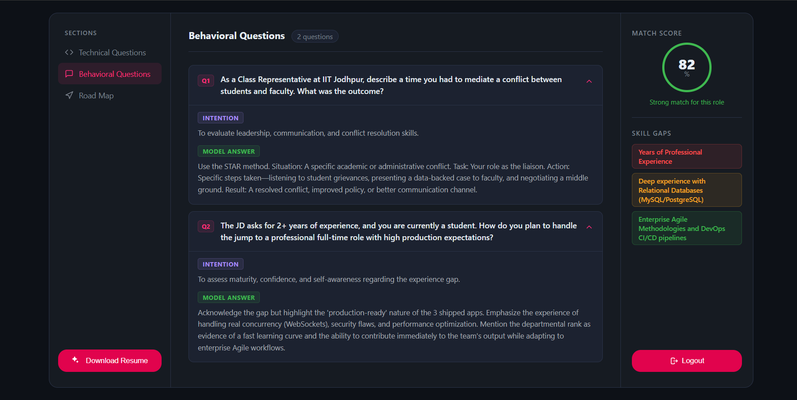
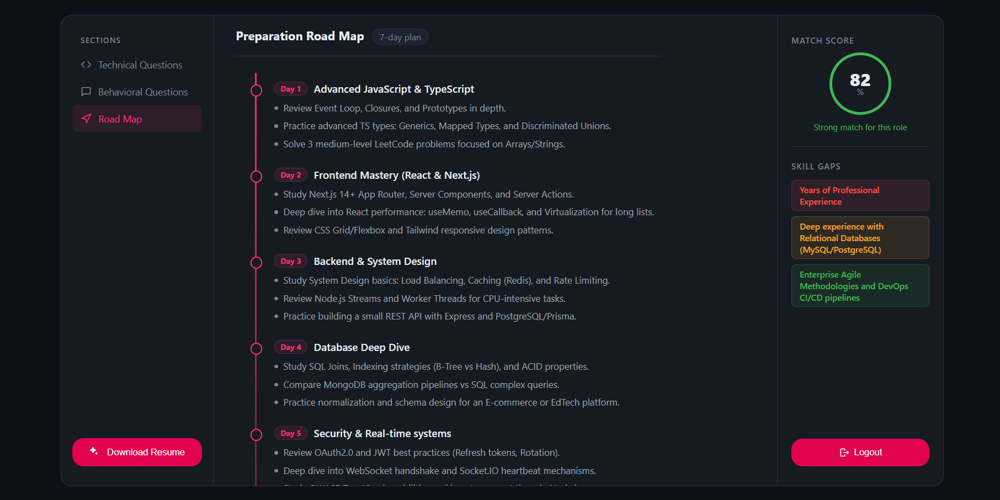
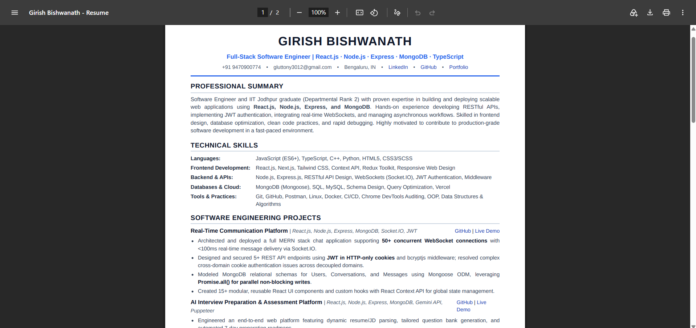

# InterviAI

<div align="center">

<table>
  <tr>
    <td align="center" valign="middle">
      
    </td>
    <td align="left" valign="middle">
      <h1>InterviAI</h1>
    </td>
  </tr>
</table>

<strong>AI-powered interview preparation built around your target role, profile, and skill gaps.</strong>

<br/>

[](https://ai-interview-preparation-coral.vercel.app/)
[](https://react.dev/)
[](https://vite.dev/)
[](https://expressjs.com/)
[](https://www.mongodb.com/)
[](https://ai.google.dev/)
[](https://developers.google.com/identity)
[](https://vercel.com/)
[](https://render.com/)
[](./LICENSE)

[**Live Demo**](https://ai-interview-preparation-coral.vercel.app/) · [**Source Code**](https://github.com/GirishBishwanath/AI_Interview_Preparation)

</div>

---

## Overview

InterviAI is a full-stack AI interview preparation platform that turns a target job description and candidate profile into a structured preparation plan.

**Target role → Candidate profile → AI analysis → Interview plan → Resume export**

The current application can produce role-specific technical and behavioral questions, interviewer intent, model answers, a profile-to-role match score, skill-gap analysis, a day-wise preparation roadmap, and a tailored resume that can be exported as PDF.

---

## Product Preview

A visual walkthrough of the current application.

<table>
  <tr>
    <td align="center" width="50%"><strong>Register</strong><br/><br/></td>
    <td align="center" width="50%"><strong>Login</strong><br/><br/></td>
  </tr>
</table>

<table>
  <tr>
    <td align="center" width="50%"><strong>Create Interview Plan</strong><br/><br/></td>
    <td align="center" width="50%"><strong>Technical Questions</strong><br/><br/></td>
  </tr>
  <tr>
    <td align="center" width="50%"><strong>Behavioral Questions</strong><br/><br/></td>
    <td align="center" width="50%"><strong>7-Day Preparation Roadmap</strong><br/><br/></td>
  </tr>
</table>

### Generated Resume



---

## Core Capabilities

| Area | What InterviAI does |
| --- | --- |
| **Authentication** | Email/password auth, JWT cookies, Google OAuth 2.0, protected routes |
| **Job Matching** | Analyzes the target job description against the candidate profile |
| **Technical Prep** | Generates role-specific technical questions with interviewer intent and model answers |
| **Behavioral Prep** | Generates behavioral questions tailored to the profile and role |
| **Skill Gaps** | Identifies missing or weaker skills with low/medium/high severity |
| **Preparation Plan** | Produces a structured day-wise preparation roadmap |
| **Resume Generation** | Generates a tailored, ATS-oriented resume and exports it as PDF |
| **History** | Stores generated interview plans so previous reports can be reopened |

---

## Product Flow

```text
Candidate
   │
   ├── Target Job Description
   │
   └── Profile
       ├── Resume PDF
       └── Self Description
             │
             ▼
      InterviAI Backend
        Node.js + Express
             │
      ┌──────┴──────┐
      ▼             ▼
 Google Gemini   MongoDB
   AI analysis   persistence
      │
      ▼
 Interview Report
 ├─ Match Score
 ├─ Technical Questions
 ├─ Behavioral Questions
 ├─ Skill Gaps
 └─ Preparation Roadmap
      │
      ▼
 Tailored Resume
   HTML → PDF
```

---

## Architecture

```text
React + Vite
     │
     │ HTTP + credentials
     ▼
Node.js + Express
     ├──────────────► Google Gemini
     ├──────────────► MongoDB / Mongoose
     └──────────────► Puppeteer + Chromium
                              │
                              ▼
                         Resume PDF
```

| Layer | Responsibility |
| --- | --- |
| **Frontend** | Forms, routing, authentication state, interview-plan UI, report navigation |
| **API** | Authentication, protected endpoints, upload handling, report generation |
| **AI Service** | Prompt construction, Gemini calls, retries, structured response validation |
| **Persistence** | User accounts and generated interview reports in MongoDB |
| **PDF Pipeline** | Generate resume HTML with AI and render it to A4 PDF |

---

## Authentication

```text
Email + Password ──► JWT ──► HTTP-only Cookie ──► Protected APIs

Google OAuth 2.0 ──► Backend Callback ──► JWT ──► HTTP-only Cookie
```

- Passwords are hashed with `bcryptjs`.
- Authentication uses an HTTP-only cookie.
- The frontend sends credentials with authenticated API requests.
- Google OAuth is handled by Passport.js on the backend.
- Protected interview routes require authentication middleware.
- Normal interview-report retrieval is scoped to the authenticated user.

---

## AI Pipeline

The backend uses Google's `@google/genai` SDK.

Structured interview output includes:

```text
matchScore
technicalQuestions[]
behavioralQuestions[]
skillGaps[]
preparationPlan[]
title
```

Each question contains:

```text
question
intention
answer
```

The AI service also retries rate-limit/quota failures before returning an error.

---

## Resume & PDF Pipeline

```text
Candidate profile
      +
Target job description
      │
      ▼
  Google Gemini
      │
      ▼
  Resume HTML
      │
      ▼
Puppeteer Core + @sparticuz/chromium
      │
      ▼
     A4 PDF
```

---

## API Reference

### Authentication

| Method | Endpoint | Purpose |
| --- | --- | --- |
| `POST` | `/api/auth/register` | Register a new account |
| `POST` | `/api/auth/login` | Login with email/password |
| `GET` | `/api/auth/google` | Start Google OAuth |
| `GET` | `/api/auth/google/callback` | Complete Google OAuth |
| `GET` | `/api/auth/get-me` | Fetch current authenticated user |
| `GET` | `/api/auth/logout` | Logout and clear authentication |

### Interview Preparation

| Method | Endpoint | Purpose |
| --- | --- | --- |
| `POST` | `/api/interview/` | Generate and persist an interview plan |
| `GET` | `/api/interview/` | List the authenticated user's saved plans |
| `GET` | `/api/interview/report/:interviewId` | Fetch one saved report |
| `POST` | `/api/interview/resume/pdf/:interviewReportId` | Generate the tailored resume PDF |

---

## Technology Stack

| Layer | Technology |
| --- | --- |
| **Frontend** | React 19, Vite 7, React Router 7, SCSS |
| **Backend** | Node.js, Express 5 |
| **Database** | MongoDB, Mongoose |
| **AI** | Google Gemini via `@google/genai` |
| **Authentication** | JWT, HTTP-only cookies, Passport.js, Google OAuth 2.0 |
| **Resume Parsing** | `pdf-parse` |
| **PDF Generation** | Puppeteer Core, `@sparticuz/chromium` |
| **Uploads** | Multer |
| **HTTP Client** | Axios |
| **Deployment** | Vercel, Render, MongoDB Atlas |

---

## Project Structure

```text
AI_Interview_Preparation/
├── Backend/
│   ├── package.json
│   ├── server.js
│   └── src/
│       ├── app.js
│       ├── config/
│       │   ├── database.js
│       │   └── google.strategy.js
│       ├── controllers/
│       │   ├── auth.controller.js
│       │   └── interview.controller.js
│       ├── middlewares/
│       │   ├── auth.middleware.js
│       │   └── file.middleware.js
│       ├── models/
│       │   ├── user.model.js
│       │   ├── interviewReport.model.js
│       │   └── blacklist.model.js
│       ├── routes/
│       │   ├── auth.routes.js
│       │   └── interview.routes.js
│       ├── services/
│       │   └── ai.service.js
│       └── utils/
│           └── authToken.js
│
├── Frontend/
│   ├── package.json
│   ├── vite.config.js
│   ├── vercel.json
│   ├── index.html
│   ├── public/
│   │   └── assets/
│   │       └── ai_interview_prep_logo.png
│   └── src/
│       ├── App.jsx
│       ├── app.routes.jsx
│       ├── components/
│       │   ├── Loader.jsx
│       │   └── loader.scss
│       └── features/
│           ├── auth/
│           └── interview/
│
├── assets/
│   └── screenshots/
│       ├── 01-register.png
│       ├── 02-login.png
│       ├── 03-home.png
│       ├── 04-technical-questions.png
│       ├── 05-behavioral-questions.png
│       ├── 06-roadmap.png
│       └── 07-generated-resume.png
│
├── LICENSE
└── README.md
```

---

## Getting Started

### Prerequisites

- Node.js 20+
- npm
- MongoDB or MongoDB Atlas
- Google Gemini API key
- Google Cloud OAuth 2.0 credentials for Google Sign-In

### Clone

```bash
git clone https://github.com/GirishBishwanath/AI_Interview_Preparation.git
cd AI_Interview_Preparation
```

### Backend

```bash
cd Backend
npm install
npm run dev
```

The current backend server starts on `http://localhost:3000`.

### Frontend

Create `Frontend/.env`:

```env
VITE_API_BASE_URL=http://localhost:3000
```

Then:

```bash
cd ../Frontend
npm install
npm run dev
```

The Vite development server runs on `http://localhost:5173` by default.

---

## Environment Variables

### Backend — `Backend/.env`

```env
MONGO_URI=your_mongodb_connection_string
JWT_SECRET=your_long_random_secret
GOOGLE_GENAI_API_KEY=your_gemini_api_key
GOOGLE_CLIENT_ID=your_google_oauth_client_id
GOOGLE_CLIENT_SECRET=your_google_oauth_client_secret
BACKEND_URL=http://localhost:3000
FRONTEND_URL=http://localhost:5173
NODE_ENV=development
```

### Frontend — `Frontend/.env`

```env
VITE_API_BASE_URL=http://localhost:3000
```

Never commit real credentials or API keys.

---

## Production Deployment

| Component | Platform |
| --- | --- |
| Frontend | Vercel |
| Backend | Render |
| Database | MongoDB Atlas |

For production, configure the backend with the deployed frontend/backend URLs and keep the backend CORS allow-list aligned with the deployed frontend origin.

The frontend includes a Vercel rewrite so client-side routes can be refreshed without a static-host 404.

---

## Current Implementation Notes

The documentation below reflects the code currently committed to `master`.

### Resume input

The frontend currently advertises PDF/DOCX up to 5 MB, while the backend upload middleware limits uploads to 3 MB and the report controller parses the uploaded content through `pdf-parse`. The implemented parsing path is PDF-focused.

### Self-description fallback

The frontend provides a Quick Self-Description field, but the current backend report-generation controller still reads `req.file.buffer` before generation. Fileless generation therefore still needs backend alignment.

### Resume PDF authorization

The resume-PDF controller currently looks up a report by ID without also applying the authenticated user's ID. An ownership check should be added before this endpoint is considered fully hardened.

### Testing and CI

The current repository does not include a dedicated automated test suite or GitHub Actions CI workflow.

---

## Roadmap

- [ ] Complete self-description-only report generation
- [ ] Add real DOCX parsing and align upload limits/validation
- [ ] Add ownership validation to resume PDF generation
- [ ] Add backend unit and integration tests
- [ ] Add frontend automated testing
- [ ] Add GitHub Actions CI
- [ ] Improve AI quota/billing error UX
- [ ] Add richer interview-session and preparation features

---

## Contributing

Keep changes focused and verify them locally before opening a pull request.

```bash
git checkout -b feature/your-feature
git add .
git commit -m "feat: describe your change"
git push origin feature/your-feature
```

Then open a Pull Request against `master`.

---

## License

InterviAI is released under the **MIT License**.

See [`LICENSE`](./LICENSE) for the complete license text.

<div align="center">

Built by **[Girish Bishwanath](https://github.com/GirishBishwanath)**

</div>